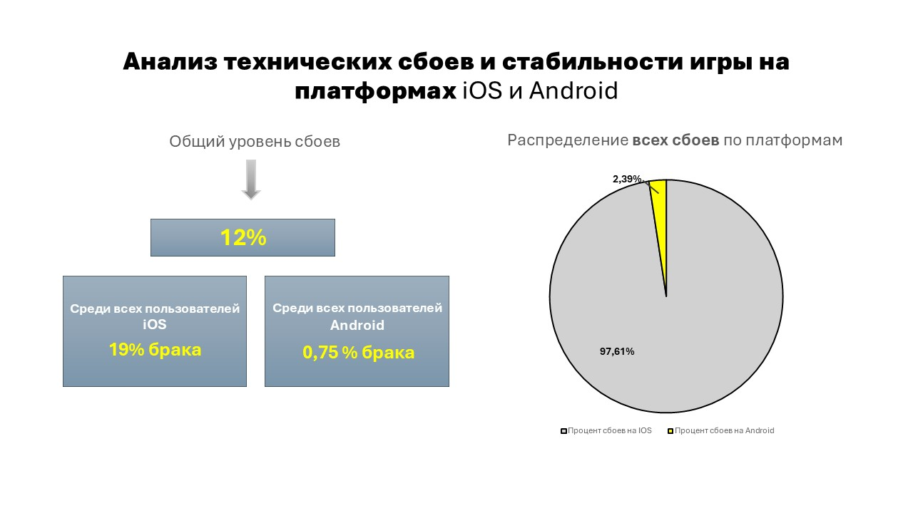

# 🎮 Кейс: Анализ продуктовых и финансовых метрик игровой платформы (SQL)

### 🎯 Цель проекта
Оценить динамику пользовательской базы, активность игроков, финансовые результаты и показатели вирусного роста (K-factor) для оптимизации маркетинговых затрат.

### 🛠 Используемые инструменты
* **PostgreSQL** (Конструкции `CASE WHEN`, агрегатные функции, сложные соединения `JOIN`, подзапросы и обобщенные табличные выражения `CTE`)
* **MS Excel** (Постобработка данных, финальная визуализация)

---

### 📂 Полные материалы проекта
> **Примечание для проверяющих:** Ниже представлена краткая выжимка исследования. Полная база данных и запросы находятся в файлах репозитория.

* 🖥️ **[Смотреть полную видео презентацию проекта](https://drive.google.com/file/d/1Ru2geK_SkKEwHBgqLTpxAvS30-HvDi9z/view?usp=sharing)**

---

### 👩‍💻 Что было сделано в рамках проекта:

* **Аудит активности:** Провела анализ количества пользователей и игровых сессий. Оценила динамику метрик `DAU` / `WAU` / `MAU` и их соотношение (Sticky Factor).
* **Поиск технических проблем:** Рассчитала долю проблемных сессий по типам устройств и выявила технические аномалии, мешающие игрокам.
* **Анализ лояльности:** Протестировала разные критерии определения лояльности и рассчитала точную долю удержанных (Loyal) пользователей.
* **Расчет вирусного роста:** Определила коэффициент вирусности игры (`K-factor`) и спрогнозировала средний размер будущих когорт.
* **Финансовый анализ:** Проанализировала динамику выручки и оценила, как маркетинговая кампания повлияла на финансовые показатели игры.

---

### 📈 Примеры ключевых графиков и выводов


* **Вывод по графику 1:** [Выявлен экстремальный рост вовлеченности, по которому было выдвинуто две гипотезы].

* **Вывод по графику 2:** [Выявлен высокий показатель вирусности игр и рассчитан предполагаемый приток игроков].

* **Вывод по графику 3:** [В ходе анализа выявлена критическая уязвимость в коде под IOS, которую необходимо исправлять в приоритетном порядке].


### 🧑‍💻 Примеры написанных SQL-запросов

# Анализ лояльности маркетинговых когорт (SQL)

### 📊 Кейс: Оценка эффективности таргетированной рекламы

**Бизнес-задача:**  
В ноябре-декабре 2022 года компания протестировала дорогую альтернативную стратегию привлечения клиентов. Необходимо проверить гипотезу: стали ли новые игроки более «лояльными» и проводят ли они больше времени в игре.

**Алгоритм решения:**
* Разделение пользователей на сегменты (целевая когорта и остальные) через `CASE WHEN`.
* Сохранение игроков без сессий с помощью `LEFT JOIN`.
* Фильтрация нецелевых сессий (берем в расчет только визиты строго длиннее 5 минут).

```sql
SELECT 
    CASE 
        WHEN u.reg_date BETWEEN '2022-11-01' AND '2022-12-31' THEN 'когорта 11-12.2022'
        ELSE 'остальные когорты' 
    END AS cohort_segment,
    AVG(s.end_session - s.start_session) AS avg_session_duration
FROM skygame.users u
-- Фильтр > 5 минут перенесен в ON, чтобы LEFT JOIN не превратился в INNER JOIN
LEFT JOIN skygame.game_sessions s 
    ON u.id_user = s.id_user 
    AND (s.end_session - s.start_session) > INTERVAL '5 minutes'
GROUP BY 1;
```

### 🏆 Финальный результат
Подготовлена финальная презентация с выводами и графиками. Результаты исследования наглядно демонстрируют сильные и слабые стороны текущей игровой экономики, помогают ИТ-команде локализовать баги на устройствах, а маркетологам точнее рассчитывать окупаемость трафика.
